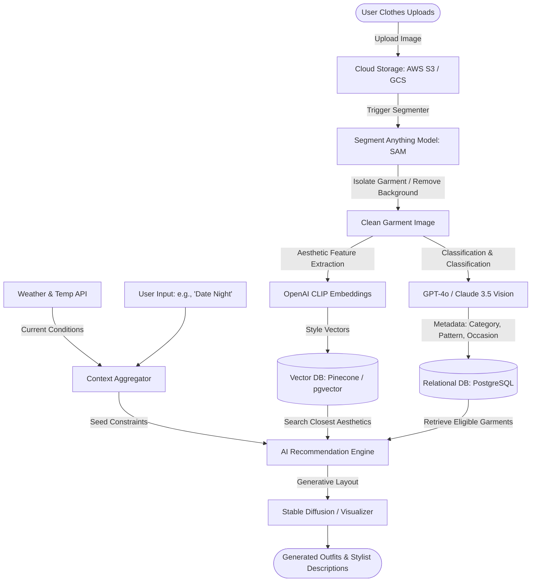

## 1. High-Level System Architecture

## 2. Step-by-Step Pipeline & Tech Stack

### Phase A: Wardrobe Ingestion & Computer Vision (The "Upload" Stage)
When the user uploads a photo (often taken in poor lighting, on a hanger, or flat-lay on a bed), the system must isolate the clothes and understand what they are.

* **Background Removal & Segmentation**
  * *How it works:* Isolates the garment from the background, removing shadows, hangers, and floors.
  * *Tech Stack:* SAM (Segment Anything Model) by Meta or Remove.bg API to extract the raw foreground alpha-channel image.
* **Visual Feature & Style Extraction**
  * *How it works:* Converts the visual design (textures, cuts, aesthetic style) of the clothing item into a numerical array (embedding vector) representing its look.
  * *Tech Stack:* OpenAI's CLIP (Contrastive Language-Image Pre-Training). CLIP matches images and text descriptions in the same multidimensional space, meaning a visual picture of a "distressed blue denim jacket" maps directly to those conceptual words.
* **Auto-Tagging & Metadata Generation**
  * *How it works:* Automatically classifies the item (e.g. Category: T-shirt, Color: Emerald Green, Style: Casual, Sub-style: Oversized, Material: Heavy Cotton, Weather suitability: Warm).
  * *Tech Stack:* Claude 3.5 Sonnet / GPT-4o (Vision API) or custom-trained ResNet-50 models trained on fashion databases (like DeepFashion).

### Phase B: Database & Vector Indexing (The "Storage" Stage)
To generate outfits instantly, clothing items must be cataloged so they can be filtered and retrieved dynamically.

* **Relational Database (Metadata Storage)**
  * *How it works:* Stores structured metadata: when the item was last worn, its size, the user's ratings, and category filters.
  * *Tech Stack:* PostgreSQL or MongoDB.
* **Vector Database (Aesthetic Matching)**
  * *How it works:* Stores the high-dimensional style vectors generated by CLIP. This allows the system to do mathematical searches (e.g. "Find items in the closet that have a visual aesthetic that matches these brown leather boots").
  * *Tech Stack:* Pinecone, Milvus, or pgvector (Postgres extension).

### Phase C: The Outfit Recommendation Core (The "Stylist" Stage)
How the system combines individual items (tops, bottoms, outerwear, footwear, accessories) into a cohesive, fashionable outfit coordinate.

* **Aesthetic Styling Model (Graph Neural Networks)**
  * *How it works:* The closet is represented as a Graph. Nodes are individual clothes; edges are high-scoring combinations. The GNN is trained on massive datasets of lookbooks, Instagram style feeds, and e-commerce bundles to learn what items look harmonious together.
  * *Tech Stack:* PyTorch Geometric (PyG) or DGL (Deep Graph Library).
* **The Rule Engine (Classical Style Guidelines)**
  * *How it works:* Enforces structural guardrails. For example, color-wheel theory (monochromatic, complementary, triadic matches), formal-level checks (don't mix a tuxedo jacket with track pants), and seasonality (check local weather via OpenWeatherMap API to filter out shorts if it is freezing).
  * *Tech Stack:* Node.js / Python Rules Engines (e.g. json-rules-engine).
* **LLM-Augmented Personal Stylist**
  * *How it works:* You pass the filtered set of matching candidates, the current weather, and the user's custom prompt (e.g. "I'm going to a semi-casual rooftop networking event") to a Generative LLM. The LLM acts as the master coordinator, selecting the final set of items and writing a premium styling description explaining why this outfit works.
  * *Tech Stack:* LangChain / LangGraph orchestrating Claude 3.5 Sonnet (highly capable in aesthetic logic).

### Phase D: Virtual Visualizer (The "Try-On" Stage - Optional Premium Feature)
Instead of just showing a collage of flat clothing items, advanced platforms show how the clothes look naturally draped on a human body.

* *How it works:* Generates a virtual model matching the user's basic body parameters (height, weight, skin tone) and dynamically overlays/drapes their actual clothing photos on the avatar.
* *Tech Stack:* Stable Diffusion (with ControlNet and IP-Adapters) or specialized virtual try-on models like TryOnDiffusion.
